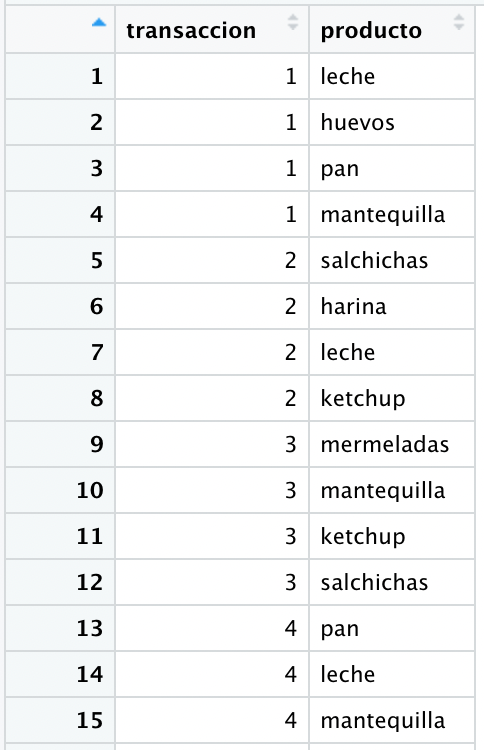
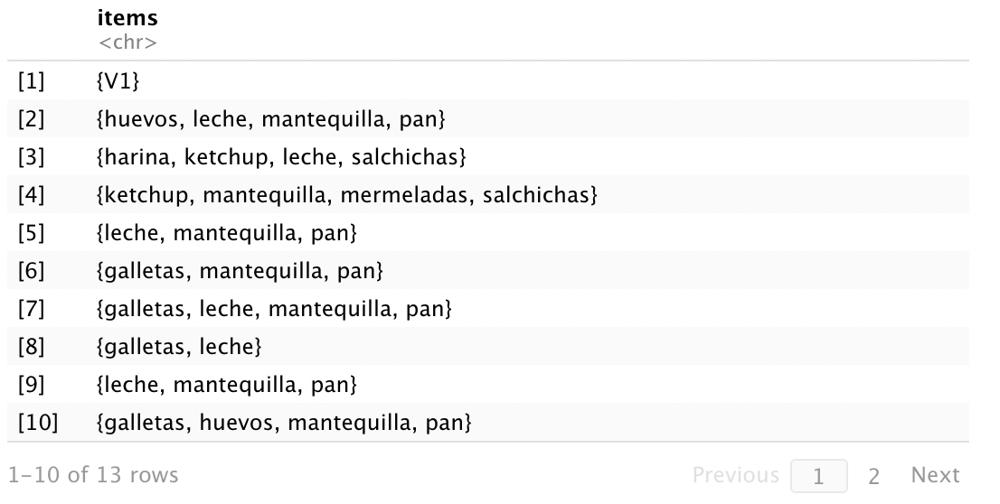
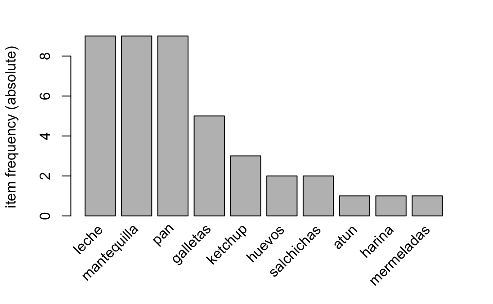
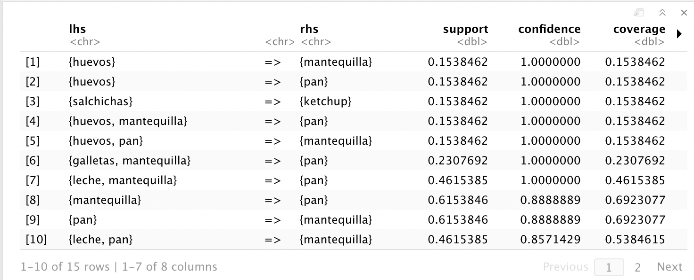
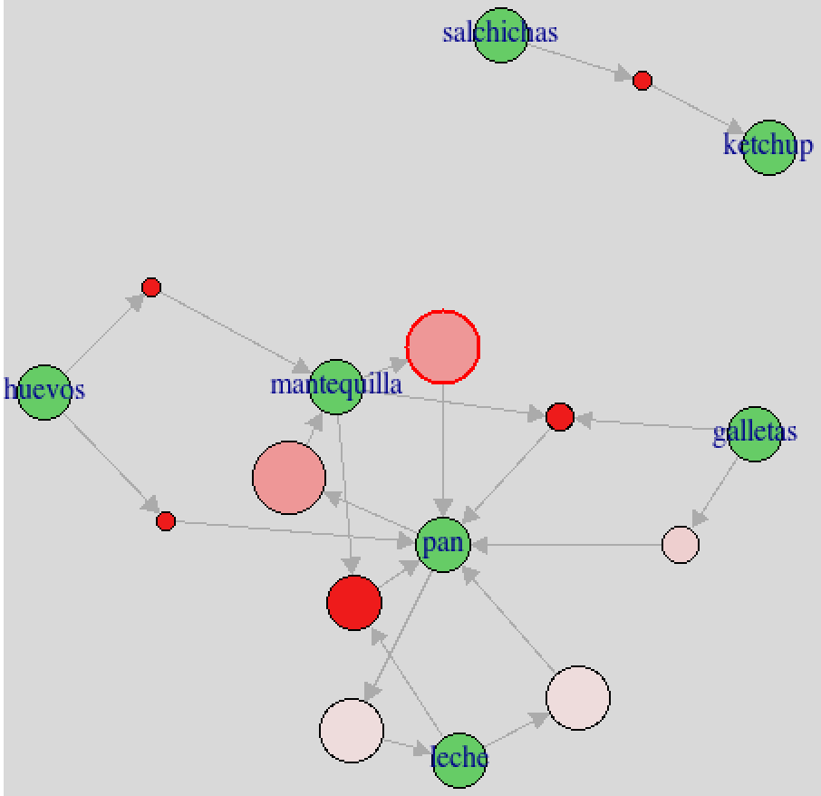
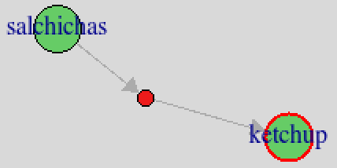
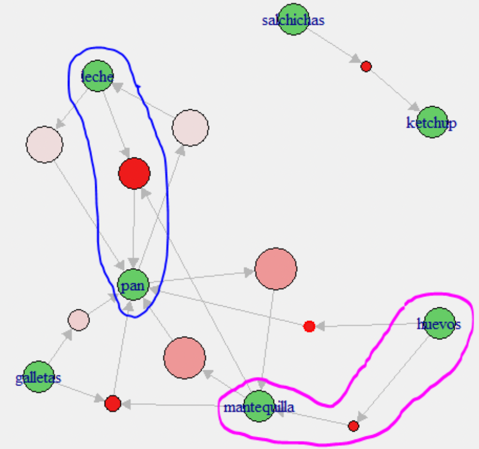

## Algoritmo Apriori.
El algoritmo `Apriori` es uno de sus algoritmos que utilizamos en nuestras consultorías, fué propuesto por Agrawall y Srikant en 1994. Es un algoritmo de minería de datos, de reglas de asociación. El agoritmo Apriori opera con bases de datos de transacciones (artículos comprados por clientes), donde cada transacción es un conjunto de ítems.

El algoritmo apriori es muy utilizado en el marketing, sus usos son del tipo _“porque usted compró X, le podría interesar Y”_. Permite planificar mejor las campañas de marketing, las ventas y el merchandising (por ejemplo, es muy utilizado en supermercados, centros comerciales o mall), es por ello, que el algoritmo apriori es conocido también como el **Análisis de la Cesta de Compras**.

## Aspectos técnicos
### Indicadores de rendimiento
**Soporte (support)**: es  la frecuencia relativa de una regla con respecto al total de transacciones.

**Confianza (confidence)**: mide qué tan confiable es la suposición hecha por la regla. La confianza es “más” importante que el soporte, es decir, soporte y confianza deben ser analizados juntos.

**Empuje (lift)**: Ayuda a detectar si el producto que aparece en **rhs** (consecuente), se debe a que se dió la combinación de los productos que aparecen en la columna **lhs** (antecedente), o no.

**Lift > 1** => La probabilidad del consecuente (rhs) aumentó gracias a que se dió el antecedente (lhs).

**Lift = 1** => La probabilidad del consecuente (rhs) no se vió afectada por el antecedente (lhs) - los productos son independientes.

**Lift < 1** => La probabilidad del consecuente (rhs) disminuyó debido a que se dió el antecedente (lhs).

**Antecedente (lhs, left-hand size)**: Producto o productos comprados.

**Consecuente (rhs, right-hand size)**: Producto comprado debido a que se dió el antecedente.

**Regla de asociación**: {lhs} => {rhs}

### Reglas redundantes
El algoritmo por defecto genera reglas redundantes, se las debe quitar del resultado o se las omite. X => Y es rediundante si existe un subconjunto de X\', tal que exista una regla X\' => Y cuyo soporte sea mayor.

| Considere los siguientes ejemplos:   |   |   |
|---|---|---|
| [9] {Pan}             | => {Mantequilla}  | Support = 0.667  |
| [10] {Leche, Pan}     | => {Mantequilla}  | Support = 0.25   |
| [14] {Galletas, Pan}  | => {Mantequilla}  | Support = 0.25   |

Las reglas 10 y 14 son redundantes con la 9; se elimina a 10 y 14 (ya que tiene más productos y menor soporte), se queda la 9.

| Otro caso:   |   |   |
|---|---|---|
| [13] {Pan, Pan}          | => {Leche}  | Support = 0.583 |
| [15] {Mantequilla, Pan}  | => {Leche}  | Support = 0.5   |

La regla 15 es redundate con 9; se elimina la 15 (ya que tiene más productos y menor soporte); se queda la 13.

## Caso 1
Se cuenta con la siguiente base de datos de transacciones (compras que realizan 12 clientes en un supermercado).

Veamos las primeras 15 transacciones:

<left>  </left>

La siguiente tarea es realizar varias transformaciones de modo que el algoritmo pueda interpretar los datos cargados.

<left>  </left>

Posteriormente obtenemos nuestra primera gráfica (Top 10 de los productos más vendidos):

<left>  </left>

Aplicamos el algoritmo **Apriori**, en el cual definimos un soporte bajo (de 0.1) y una confianza alta (0.7), esto con el fin de encontrar productos que se han vendido juntos más frecuentemente.

Finalmente visualizamos las reglas obtenidas:

<left>  </left>

Para finalizar, se crea un gráfico interactivo (grafo) que permite visualizar e interpretar las reglas de asociación. 

<left>  </left>

**Interpretación del grafo:**
- En los nodos del grafo se observan los productos que forman parte de la regla.
- Las flechas llevan del producto antecedente (lhs) al consecuente (rhs). (Las salchichas son antecedente del kétchup que es consecuente).

<left>  </left>

- Entre los nodos se observan círculos: mientras más rosa (no confundir con rojo) sea este, se presenta mayor confianza en la regla; mientras se acerque al rosa pálido, menor será la confianza.
- El círculo rojo indica una conexión entre nodos (o productos).
- El tamaño del círculo indica el soporte (support) de la regla: círculos más
pequeños, indican menor soporte (menor frecuencia de la regla con respecto al total de transacciones); y círculos más grandes indican mayor soporte (mayor frecuencia de la regla en las transacciones).

Por ejemplo, interpretando 3 reglas de asociación:

<left>  </left>

- Dado que un cliente compró leche, compró pan; se tiene un soporte del 53% (es decir, esta regla se dio en el 53% de las transacciones) y una confianza del 77,8% (es decir, que en el 77,8% de las transacciones en que se compró leche, se compró pan).
- Dado que un cliente compró huevos, compró mantequilla; se tiene un soporte del 15,4% (es decir, esta regla se dió en el 15,4% de las transacciones) y una confianza del 100% (es decir, que en el 100% de las transacciones en que se compró huevos, se compró mantequilla).
- Dado que un cliente compró galletas y mantequilla, también compró pan; con un soporte del 23,1% (es decir, esta regla se dio en el 23,1% de las transacciones) y una confianza del 100% (es decir, que en el 100% de las transacciones en que se compró galletas y mantequilla, se compró pan).

## Caso hipotético de aplicación
Suponga que usted es el Gerente de Marketing de un supermercado (o algún retail) solicita que se haga un pack promocional tomando en cuenta 2 productos. Le dan a escoger entre "pan y huevos" o "pan y mantequilla", _¿Cuál de esas 2 combinaciones de productos escogería para aplicar la promoción?_

- **Opción A**: entre “pan y huevos” se tiene una confianza del 100% (el 100% de las personas que compraron huevos, compraron pan) y un soporte de 15,38% (en el 15,38% de las transacciones se compró pan y huevos).
- **Opción B**: entre “pan y mantequilla” se tiene una confianza del 88,9% (el 88,9% de las personas compraron mantequilla, compraron pan) y un soporte del 61,54% (en el 61,54% de las transacciones se compró pan y mantequilla).

> Parece simple no?, lo hemos hecho simple para usted, contáctenos y conversemos para implementar este proyecto en su empresa.

