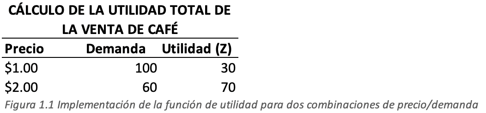

## Objetivo y Propósito
En nuestras consultorías empezamos con la siguiente pregunta: _¿Como podemos ayudarle a usted como gerente o futuro gerente a responder preguntas específicas relacionadas con el uso de la fijación de precios como una función táctica u operativa en el día a día?_.

Ejemplos de tales preguntas incluyen:
- ¿Tenemos la oportunidad de utilizar el precio como una herramienta para aumentar las utilidades operativas en su empresa?
- ¿Cuál es el impacto en las ganancias operativas de las mejoras de precios en comparación con las mejoras en los costos?
- ¿Qué cambio en el volumen de ventas se requiere para que un aumento de precio del 5% alcance el punto de equilibrio?
- ¿Cómo podemos determinar la incertidumbre asociada con un cambio de volumen derivado de un cambio de precio específico?
- ¿Cómo podemos estimar la disposición a pagar de nuestros clientes a partir de transacciones históricas o datos empíricos?
- ¿Cómo podemos usar la información sobre la disposición a pagar de nuestros clientes para formar funciones de precio-respuesta y, posteriormente, ajustar el precio para maximizar las utilidades?
- ¿Cómo podemos vender el mismo producto o servicio a diferentes compradores a diferentes precios para aumentar las utilidades?
- ¿Cómo podemos ajustar dinámicamente, y posiblemente rebajar, el precio para maximizar las utilidades?

Veamos algunas de la metodología que utilizamos en las consultorías para responder estas preguntas.

## La decisión más importante
El precio es el generador de utilidad más efectivo, partimos de la definición simple de utilidad.

`\(utilidad = (precio * volumen) - costo\)`

La fórmula de la utilidad muestra que solo hay tres impulsores de la utilidad: precio, volumen y costos (que a su vez tienen componentes fijos y variables)

Para demostrar la influencia de cada uno de estos factores, veamos el siguiente ejemplo de una estructura de precios típica.

Imaginemos que una empresa vende 1 millón de unidades de un producto a un precio de \$100 la unidad. La empresa tiene \$30 millones en costos fijos, mas \$60 es costos variables por unidad. Esto dá como resultado ingresos por ventas de \$100 millones y una utilidad de \$10 millones. En rendimiento de las ventas es del 10%. 

**_Que efecto tendría sobre las utilidades un cambio aislado (ceteris paribus) del 5% en uno de los generadores de utilidades?._**

En la siguiente imagen vemos la respuesta:

  

Un aumento del 5% en el precio significa que el precio ahora es de \$105, manteniendo todos los demás factores constantes, los ingresos aumentarían a \$105 millones. La utilidad aumenta de \$10 a \$15 millones. Una mejora del 50%. Para los otros generadores de utilidad los cambios porcentuales son 30, 20 y 15%.

No menos interesante es la perspectiva inversa, que examina las consecuencias de una disminución del 5% en un generador de utilidad individual. La imagen muestra lo que sucede:

  

La consecuencia es la imagen espejo. De la misma manera que un aumento de precio tiene la influencia positiva mas fuerte en las utilidades, una disminución de precios tiene la influencia negativa mas fuerte.

Como podemos ver, cambiar el precio, tiene un impacto mucho mayor, positivo o negativo en las utilidades que al cambiar el volumen.

## Objetivos en conflicto
En la práctica, las empresas persiguen varios objetivos simultáneamente, algunos de ellos pueden entrar en conflicto o incluso contradecirse entre sí. Por ejemplo, los objetivos de rentabilidad a menudo entran en conflicto con los objetivos de volumen, ingresos o participación de mercado.

Estas prioridades en competencia son una realidad cotidiana en las empresas, como vemos en la siguiente imagen.

  

La tabla muestra un caso en el que los objetivos de los gerentes no están alineados. Si bien el Director Ejecutivo y el Jefe de Ventas están de acuerdo en que las utilidades son mas importantes que el crecimiento o la participación de mercado, el Director Financiero concede la máxima prioridad al crecimiento. Para el Director de Marketing la cuota de mercado es el objetivo mas importante.

En la práctica, pocos gerentes hacen explícitamente que las utilidades sean su principal objetivo, a pesar de lo que sugiere la tabla.

## El desafío de las organizaciones
- Para muchas organizaciones, la fijación de precios incluye un conjunto de decisiones notablemente complejo (**es abrumador fijar el precio**). 
- Si bien la mayoría de las empresas tiene una buena idea de los precios de lista que han establecido para sus productos, **a menudo no tienen claro el precio que los clientes están realmente pagando.**
- A menundo se aplica una multitud de diferentes descuentos, ajustes y reembolsos a cada venta, por esta razón **es fundamental distinguir entre el precio de lista de un bien y su precio de bolsillo** (es decir lo que un cliente en particular termina realmente pagando).
- El precio de lista es genérico, mientras que el precio de bolsillo puede ser diferente para cada cliente. La cascada de precios (_Price waterfalls_) fue presentada por **McKinsey and Company** como una forma gráfica de ilustrar los descuentos que ocurren entre el precio de lista de un bien y su precio de bolsillo.

  

En la gráfica vemos un ejemplo en un bien de consumo. En este caso hay 12 reducciones de precios o descuentos aplicados entre el precio de lista y el precio de bolsillo. Estos incluyen:

- Un 8% en descuento competitivo
- 3% por venta especial.
- 1% por “acuerdo de excepción”.

Y así sucesivamente hasta un 1% de flete. El resultado neto es que el precio de bolsillo para este cliente es un 29% menor que el precio de lista.

La cascada de precios ilustra con bastante claridad que el precio de bolsillo pagado por un cliente individual es a menudo no el resultado de una sola decisión, sino el resultado acumulativo de una serie de decisiones.

El descuento competitivo podría haber sido autorizado por el Gerente Regional de Ventas, mientras que la bonificación del producto se determinó como parte de un programa general de mercadeo. Y el descuento del 1% en el flete podría haberse originado por una llamada de último momento del cliente. Como resultado **_“nadie está a cargo”._**

Nadie en esta organiación es responsable del hecho de que el descuento ofrecido a este cliente fue del 29%, mientras que el ofrecido a otro fue del 18%. De hecho, no solo no hay nadie a cargo, a menudo es muy difícil determinar cual es el precio de bolsillo que paga un cliente en particular.

De hecho, la situación puede ser aún peor. Los compradores sofisticados a menudo entienden el proceso de fijación de precios aún mejor que el mismo vendedor. Un departamento de compras sofisticado, ante una caída de precios como la que se vé en la imagen aprenderá como “dividir y conquistar” para obtener el precio de bolsillo mas bajo.

## Analítica de precios 
### Sensibilidad al precio y disposición a pagar
A modo de simplificar, usaremos un ejemplo muy sencillo de una cafetería interesada a maximizar sus utilidades teniendo una comprensión más clara de su gestión de precios. Por supuesto, los modelos también son aplicables a empresas más grandes.

Empezamos con una de las preguntas más importantes: **_¿Qué precio debe cobrar la cafetería por taza de café para lograr maximizar la utilidad?_**

Interesante, encontramos que la cafetería ya estaba dando sus primeros pasos. Realizó una encuesta de mercado sobre las preferencias de los consumidores en relación con el café negro normal. La encuesta indica que establecer un precio de \$1 por taza conducirá a una demanda de 100 tazas por día. Aumentar el precio a \$2 reduce la demanda a 40 tazas/día.

  

Los resultados de los cálculos los vemos en la figura 1.1 y muestran que cobrar un precio de \$2 es más rentable. Al cobrar un precio de \$2 en lugar de \$1, la utilidad total termina en \$70 en lugar de \$30, aunque el volumen de ventas es 40 tazas más bajo por día en el nivel de precio alto. 

Aunque este ejemplo es simple, nos muestra el gran impacto que el precio puede tener sobre la demanda y las utilidades. Sin hacer la encuesta y el análisis subsiguiente, el gerente podría creer erróneamente que un precio de \$1 induce la mayor utilidad.

Decidimos presentarle al gerente una gráfica que muestra la relación entre los distintos niveles de precios y la demanda (_Función de respuesta al precio_). El, propósito es ayudar al gerente a comprender cómo la cantidad demanda de café varía según el precio.

  

El objetivo ahora es establecer el precio que maximizará la utilidad total que se obtiene de la venta de tazas de café. Debemos facilitar que el gerente tome la decisión correcta en función de los datos que tenemos a mano.

Pero antes de ello, veamos la siguiente gráfica:

  

La gráfica muestra claramente que cobrar un precio \$2 induce la mayor utilidad. De hecho la diferencia entre el precio óptimo y el siguiente mejor precio en este ejemplo es de hasta un 25%. Como ya vimos al inicio de esta publicación, una mejor gestión de precios tiene el mayor impacto financiero en la utilidad operativa en comparación con variables como los costos variables, el volumen de ventas y los costos fijos. Por lo tanto: _Hacer un buen análsis de precios parece una buena inversión._

En la práctica, sin embargo, la cafetería probablemente ofrezca varios tipos de café (por ejemplo, café con leche, capuchino, espresso, etc.). También puede vender los distintos tipos de café a través de diferentes canales de venta (por ejemplo, en la cafetería, entrega a domicilio en una taza termo en el estadio deportivo local, etc.).

Finalmente, sería posible diferenciar entre varios tipos de clientes en función de algunas características simples (por ejemplo, estudiantes, jubilados, compradores frecuentes, etc.).

Las tres dimensiones (tipo de producto/servicio, canal de ventas y tipo/segmento de cliente) se pueden ver el cubo de optimiazión de precios e ingresos (Cubo PRO). El objetivo del análisis de precios es siempre encontrar el precio correcto para cada uno de los elementos relevantes del cubo.

  

## Función de respuesta al precio y demanda

  

La gráfica nos muestra la relación entre la cantidad demandada y el precio. El punto D indica que se venderían 8 tazas a un precio \$1.00. Cuando el precio aumenta a \$1.50, la cantidad demanda cae a 4 tazas (punto E). Aumentar más el precio provoca una caída a dos tazas por semana.

Cuando se dispone de la función de respuesta al precio y si se conoce el precio real cobrado por la tienda también podemos calcular, lo que se refiere la literatura económica como el _excedente del consumidor_. El excedente del consumidor se define como la diferencia entre la cantidad máxima que un consumidor determinado esta dispuesto a pagar por el bien o servicio y el precio.

Por ejemplo, si un consumidor tiene una disposición máxima a pagar de \$2.25 por una taza de café y el precio es de \$1.00, el excedente del consumidor seria \$1.25. Por tanto, podemos deducir que el excedente del consumidor es la diferencia entre la función respuesta y el precio cobrado. Este concepto lo vemos en la gráfica de la derecha.

> En nuestra consultorías le ayudamos a responder las preguntas importantes, determinamos la disposición a pagar de sus clientes para cada uno de sus productos, canales.

## La cafetería y Netflix
Bueno, fué un título muy osado, permítamos explicar nuestro punto. Imagínese ir a su cafetería favorita y que el camarero le informe que el precio cambió. En lugar de \$3 por una taza de café con crema y edulcorante, ahora se le cobrará \$2 por un café negro, \$1 por la crema y \$1 por el edulcorante que elija. Si quieres pagar tus habituales \$3 por una taza de café, debes elegir entre crema y edulcorante. Si deseas ambos, ahora enfrentas a un cargo adicional de \$1.

Quizás antes esta situación sonaba absurda, hoy en día ya es común. Esta es la situación en la que se encontraron los clientes de Netflix en 2011: _“un aumento de precios del 60% para retener el mismo servicio”._

A principios de 2011, los consumidores de netflix pagaron alrededor de \$10 al mes por un paquete que consistía en transmisión de video y alquiler de DVD. En julio de 2011, la compañía anunció un cambio en el paquete. A los clientes que deseen retener tanto la transmisión de video como el alquiler de DVD se les cobrará \$15.98 por mes, un aumento de precio de aproximadamente el 60%.

En 2014, Netflix también aumentó el precio de su suscripción de video streaming de \$7.99 a \$8.99 por mes. La compañía también cambió su política de contenido de transmisión de 4k de \$9.00 a \$12. por mes.

**_Cómo reaccionaron los clientes de Netflix?_**. _Cuánto afectaría este cambio de precio a la demanda de productos de Netflix?_. Las respuestas a esas preguntas es lo que los economistas llaman _elasticidad_.

